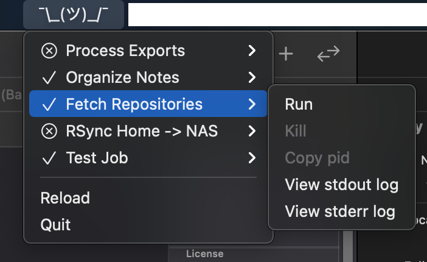

#  LousyJob

This is a very simple background job runner for macOS.
I use it for things like periodically exporting data from cloud services.



## Motivations

- launchd is cumbersome to configure and getting visibility into jobs or manually starting/stopping jobs from the CLI is a pain; I wanted something simpler
- macOS has made it increasingly difficult to authorize shell scripts to truly access all files; by giving `LousyJob.app` full disk access and any other permissions you need, all the jobs you run with it can have full access

## Features

- Define all your jobs in one JSON file
- Optionally specify a time interval for each job to run it automatically
- Status bar menu lets you easily see job status, run/kill jobs manually, and access job logs
- ...that's pretty much it

## Comparative Advantages

- No dependencies, because I'm too lazy to learn a Swift package manager
- Small, simple code base, because I barely know how to use Swift at all
- Straightforward configuration due to minimal functionality

## TODO

- Ideally, it should be configurable on each job whether or not the app passes full disk permissions etc on to that job.

## Configuration

Create a `.lousyjob` file in your home directory.
Here's a sample:

```json
{
  "interval": 600,
  "logdir": "~/.local-only/lousyjob/logs",
  "jobs": [
    {
      "id": "test",
      "title": "Test Job",
      "executable": "/bin/bash",
      "arguments": ["-lc", "echo hello world"],
      "interval": 1200
    }
  ]
}
```

The top-level `interval` specifies, in seconds, how often to check whether any jobs are due.
Note that if you set any individual job's `interval` to a lower value, they still won't run more frequently than this.

`logdir` is the path to a directory for storing logs.
Each job will get separate files for stdout and stderr as well as a file containing information about each time a run of the job started or finished.

Each entry in the `jobs` array contains:

- `id`: a unique identifier, which is used in log file names
- `title`: the job name to show in the status menu and notifications
- `executable`: path to the program the job should run
- `arguments`: array of command-line arguments; generally, as in this example, I use my shell as the executable, `-lc` as the first argument, and the actual command as the second argument, so that my PATH and anything set up in eg `.bash_profile` will be available to the command
- `interval`: optional; if present, the job will be run automatically when this many seconds have passed since the completion of the last run

## Installation

Compile the app in Xcode, place it in your Applications folder, and open it.

## License

This is available as open source under the terms of the [MIT License](https://opensource.org/licenses/MIT).
